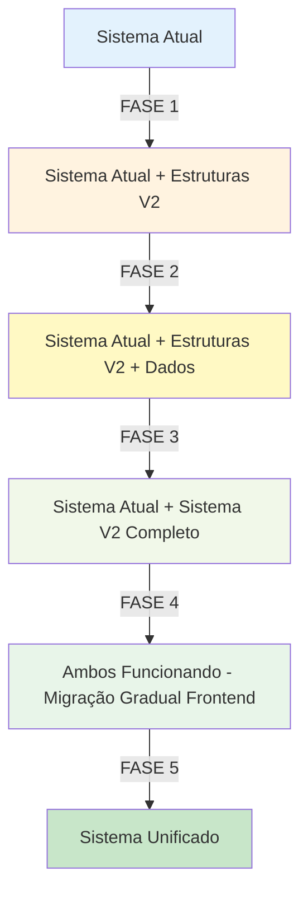

# 🎯 Estratégia de Consolidação RBAC - Arruda Hub

## 📋 Visão Geral

Estratégia para **consolidar** todo o sistema RBAC em um único local sem quebrar o sistema atual.

**Objetivo:** Unificar cadastro de usuários, login, RLS, e gestão de fornecedores (tenants) em uma estrutura centralizada e padronizada.

## ✅ O Que Estamos Fazendo

### **Consolidando:**
- ✅ **Cadastro de usuários** → Sistema RBAC centralizado
- ✅ **Login/Autenticação** → Fluxo unificado com tenant detection
- ✅ **Roles** → 9 perfis padronizados
- ✅ **Permissões** → Controle granular por tela
- ✅ **RLS Policies** → Políticas centralizadas
- ✅ **Tenants/Fornecedores** → Gestão unificada em `rbac_organizations`
- ✅ **Equipes** → Hierarquia de gestores

### **NÃO Estamos Fazendo:**
- ❌ Apagar funcionalidades existentes
- ❌ Quebrar fluxo de login atual
- ❌ Remover controles de acesso
- ❌ Deletar dados de usuários

## 🏗️ Arquitetura da Consolidação

### **Estado Atual (Disperso):**
```
┌─────────────────────────────────────────────────────┐
│ MÚLTIPLOS HOOKS DE AUTH                             │
├─────────────────────────────────────────────────────┤
│ useAuth.ts                  - Auth básico           │
│ useAuth.tsx                 - Auth duplicado        │
│ useAuthWithTenant.tsx       - Auth com tenant       │
│ useAuthWithTenantSimple.tsx - Auth simplificado     │
├─────────────────────────────────────────────────────┤
│ FUNÇÕES SQL DISPERSAS                               │
├─────────────────────────────────────────────────────┤
│ get_user_role()            - Verificação de role    │
│ is_admin()                 - Verificação admin      │
│ is_gestor()                - Verificação gestor     │
│ is_leader()                - Verificação líder      │
│ user_belongs_to_organization() - Verificação tenant │
├─────────────────────────────────────────────────────┤
│ ROLES ANTIGOS (7+)                                  │
├─────────────────────────────────────────────────────┤
│ admin, gestor, vendedor, lider, visualizador,       │
│ gestor_fornecedor, financeiro_fornecedor            │
├─────────────────────────────────────────────────────┤
│ TENANTS MISTURADOS                                  │
├─────────────────────────────────────────────────────┤
│ rbac_organizations (tabela)                         │
│ distribuidor (campo em várias tabelas)              │
│ Lógica específica de fornecedor                     │
└─────────────────────────────────────────────────────┘
```

### **Estado Consolidado (Unificado):**
```
┌─────────────────────────────────────────────────────┐
│         SISTEMA RBAC CENTRALIZADO ÚNICO             │
├─────────────────────────────────────────────────────┤
│ UM ÚNICO HOOK                                       │
├─────────────────────────────────────────────────────┤
│ useRBACAuth() {                                     │
│   - signUp/signIn/signOut unificados                │
│   - Auto-detect tenant                              │
│   - Auto-load permissões                            │
│   - Auto-load equipe gerenciada                     │
│   - hasPermission(screen, action)                   │
│ }                                                   │
├─────────────────────────────────────────────────────┤
│ FUNÇÕES SQL UNIFICADAS (V2)                         │
├─────────────────────────────────────────────────────┤
│ get_user_role_v2()              - Role único        │
│ user_has_tenant_access_v2()     - Acesso a tenant   │
│ user_has_screen_permission_v2() - Permissão tela    │
│ get_user_screen_permissions_v2()- Todas permissões  │
│ is_user_manager_v2()            - Gestão equipe     │
│ get_managed_users_v2()          - Usuários geridos  │
├─────────────────────────────────────────────────────┤
│ ROLES SIMPLIFICADOS (9)                             │
├─────────────────────────────────────────────────────┤
│ Grupo Arruda:                                       │
│ - admin, gestor, usuario, visualizador, teste       │
│ Fornecedores:                                       │
│ - gestor_fornecedor, usuario_fornecedor,            │
│   visualizador_fornecedor, teste_fornecedor         │
├─────────────────────────────────────────────────────┤
│ TENANTS UNIFICADOS                                  │
├─────────────────────────────────────────────────────┤
│ rbac_organizations (ÚNICO local)                    │
│ rbac_user_tenant_access (controle de acesso)        │
│ rbac_team_management (hierarquia)                   │
├─────────────────────────────────────────────────────┤
│ PERMISSÕES CENTRALIZADAS                            │
├─────────────────────────────────────────────────────┤
│ rbac_screen_permissions (controle por tela)         │
│ Granularidade: view, create, edit, delete, approve │
└─────────────────────────────────────────────────────┘
```

## 🔄 Estratégia de Implementação em 5 Fases

### **FASE 1: ADICIONAR Novas Estruturas** ✅
**Arquivo:** `20250131_phase1_consolidate_rbac_add_structures.sql`

**O que faz:**
- ✅ Cria 3 novas tabelas (team_management, user_tenant_access, screen_permissions)
- ✅ Cria funções V2 (não substitui as antigas)
- ✅ Adiciona novos roles (ON CONFLICT DO NOTHING)
- ✅ Cria políticas RLS para novas tabelas

**Garantia:**
- ✅ Sistema atual 100% funcional
- ✅ Nada é modificado ou deletado
- ✅ Apenas adições

### **FASE 2: POPULAR Dados** ✅
**Arquivo:** `20250131_phase2_consolidate_rbac_populate_data.sql`

**O que faz:**
- ✅ Insere permissões por tela para cada role
- ✅ Copia acesso a tenants baseado em organizacao_id
- ✅ Configura matriz completa de permissões

**Garantia:**
- ✅ Apenas insere dados (ON CONFLICT DO NOTHING)
- ✅ Não modifica dados existentes
- ✅ Sistema atual continua funcionando

### **FASE 3: VALIDAR** ✅
**Arquivo:** `20250131_phase3_consolidate_rbac_validation.sql`

**O que faz:**
- ✅ Cria função `validate_rbac_consolidation()`
- ✅ Cria função `get_consolidation_status()`
- ✅ Compara sistema antigo vs novo lado a lado
- ✅ Relatório automático de validação

**Garantia:**
- ✅ Apenas cria funções de leitura
- ✅ Não modifica nada
- ✅ Transparência total

### **FASE 4: MIGRAR FRONTEND Gradualmente** 🔄
**Arquivo:** `src/hooks/useRBACAuth.tsx`

**O que faz:**
- ✅ Hook unificado `useRBACAuth()`
- ✅ Feature flag para transição gradual
- ✅ Adapters de compatibilidade
- ✅ Migração componente por componente

**Exemplo de Migração:**
```typescript
// ANTES (componente antigo)
import { useAuth } from '@/hooks/useAuth';
const { user, signIn } = useAuth();

// DURANTE (transição - compatível)
import { useAuth } from '@/hooks/useRBACAuth'; // Mesmo nome!
const { user, signIn } = useAuth(); // Mesma interface!

// DEPOIS (novo sistema completo)
import { useRBACAuth } from '@/hooks/useRBACAuth';
const { user, signIn, permissions, hasPermission } = useRBACAuth();
if (hasPermission('users', 'gestao', 'create')) {
  // Pode criar usuário
}
```

**Garantia:**
- ✅ Migração um componente por vez
- ✅ Feature flag controla transição
- ✅ Rollback instantâneo se necessário

### **FASE 5: UNIFICAR (Quando 100% Validado)** 🎯
**Depois de semanas de validação**

**O que fazer:**
- ✅ Renomear funções V2 para padrão
- ✅ Remover funções antigas
- ✅ Limpar campos duplicados
- ✅ Consolidar políticas RLS

## 📊 Mapeamento de Roles Antigos → Novos

| Role Antigo | Role Novo | Descrição |
|-------------|-----------|-----------|
| `admin` | `admin` | ✅ Mantém igual |
| `gestor` | `gestor` | ✅ Mantém igual |
| `vendedor` | `usuario` | 🔄 Consolidado |
| `lider` | `usuario` | 🔄 Consolidado |
| `visualizador` | `visualizador` | ✅ Mantém igual |
| `gestor_fornecedor` | `gestor_fornecedor` | ✅ Mantém igual |
| `financeiro_fornecedor` | `usuario_fornecedor` | 🔄 Consolidado |
| - | `teste` | ⭐ Novo |
| - | `teste_ai` | ⭐ Novo (Automação Playwright sem exclusões) |
| - | `teste_fornecedor` | ⭐ Novo |

## 🔧 Como Executar

### **Passo 1: Executar Fase 1**
```sql
-- No SQL Editor do Supabase
-- Copiar e colar: 20250131_phase1_consolidate_rbac_add_structures.sql
```

**Validação:**
```sql
SELECT * FROM public.validate_rbac_consolidation();
-- Deve mostrar tudo ✅ PASS
```

### **Passo 2: Executar Fase 2**
```sql
-- No SQL Editor do Supabase
-- Copiar e colar: 20250131_phase2_consolidate_rbac_populate_data.sql
```

**Validação:**
```sql
SELECT * FROM public.get_consolidation_status();
-- Deve mostrar todas as estruturas criadas
```

### **Passo 3: Executar Fase 3**
```sql
-- No SQL Editor do Supabase
-- Copiar e colar: 20250131_phase3_consolidate_rbac_validation.sql
```

**Validação:**
```sql
-- Executar validação completa
SELECT * FROM public.validate_rbac_consolidation();

-- Ver status da consolidação
SELECT * FROM public.get_consolidation_status();

-- Comparar roles para um usuário específico
SELECT * FROM public.compare_user_roles_v2('user-uuid-here');
```

### **Passo 4: Migrar Frontend Gradualmente**
```typescript
// Adicionar ao .env
VITE_USE_V2_RBAC=false  # Começa desabilitado

// Testar com alguns usuários
VITE_USE_V2_RBAC=true   # Habilitar para teste

// Quando 100% validado
VITE_USE_V2_RBAC=true   # Habilitar para todos
```

## 📊 Validação Lado a Lado

### **Testar que Ambos Funcionam:**
```sql
-- Sistema ANTIGO
SELECT public.get_user_role();
SELECT public.is_admin();
SELECT public.is_gestor();

-- Sistema NOVO (V2)
SELECT public.get_user_role_v2();
SELECT public.is_admin_v2();
SELECT public.is_gestor_v2();

-- Comparar resultados
SELECT 
  public.get_user_role() as old_role,
  public.get_user_role_v2() as new_role,
  public.get_user_role() = public.get_user_role_v2() as match;
```

### **Testar Permissões:**
```sql
-- Sistema NOVO
SELECT * FROM public.get_user_screen_permissions_v2();

-- Verificar permissão específica
SELECT public.user_has_screen_permission_v2(
  auth.uid(), 
  'users', 
  'gestao', 
  'create'
);
```

### **Testar Tenants:**
```sql
-- Obter tenants acessíveis
SELECT * FROM public.get_user_accessible_tenants_v2();

-- Verificar acesso a tenant específico
SELECT public.user_has_tenant_access_v2(
  auth.uid(), 
  'tenant-uuid-here'
);
```

## 🛡️ Garantias de Segurança

### **Sem Riscos:**
- ✅ **Fase 1-3**: Apenas adiciona, nunca remove ou modifica
- ✅ **ON CONFLICT DO NOTHING**: Nunca sobrescreve dados existentes
- ✅ **Funções V2**: Não substitui funções antigas
- ✅ **Políticas V2**: Não remove políticas antigas
- ✅ **Feature Flags**: Controle total da transição

### **Rollback Instantâneo:**
```sql
-- Se algo der errado, basta desabilitar as novas tabelas
ALTER TABLE public.rbac_team_management DISABLE;
ALTER TABLE public.rbac_user_tenant_access DISABLE;
ALTER TABLE public.rbac_screen_permissions DISABLE;

-- Ou simplesmente não usar as funções V2
-- Sistema antigo continua funcionando normalmente
```

## 📋 Checklist de Implementação

### **Preparação:**
- [ ] Backup manual no Supabase Dashboard
- [ ] Documentar estado atual
- [ ] Notificar equipe (se necessário)

### **Fase 1 - Adicionar Estruturas:**
- [ ] Executar `20250131_phase1_consolidate_rbac_add_structures.sql`
- [ ] Validar: `SELECT * FROM public.validate_rbac_consolidation();`
- [ ] Verificar: 3 tabelas, 10+ funções V2, 6+ políticas V2
- [ ] Status: Sistema atual funcionando? ✅

### **Fase 2 - Popular Dados:**
- [ ] Executar `20250131_phase2_consolidate_rbac_populate_data.sql`
- [ ] Validar: `SELECT * FROM public.get_consolidation_status();`
- [ ] Verificar: Permissões criadas, acesso a tenants configurado
- [ ] Status: Sistema atual funcionando? ✅

### **Fase 3 - Validar:**
- [ ] Executar `20250131_phase3_consolidate_rbac_validation.sql`
- [ ] Executar: `SELECT * FROM public.validate_rbac_consolidation();`
- [ ] Verificar: Todas validações passam
- [ ] Status: Sistema atual funcionando? ✅

### **Fase 4 - Migrar Frontend:**
- [ ] Adicionar `useRBACAuth.tsx` ao projeto
- [ ] Configurar feature flag `VITE_USE_V2_RBAC=false`
- [ ] Testar com 1 componente
- [ ] Testar com 10% dos componentes
- [ ] Habilitar para todos: `VITE_USE_V2_RBAC=true`
- [ ] Status: Sistema atual funcionando? ✅

### **Fase 5 - Unificar (Semanas depois):**
- [ ] Monitorar por 2-4 semanas
- [ ] Validar que ninguém usa sistema antigo
- [ ] Renomear funções V2 para padrão
- [ ] Remover funções antigas
- [ ] Limpar campos duplicados

## 🎯 Fluxo de Consolidação



## 📊 Matriz de Compatibilidade

| Funcionalidade | Sistema Atual | Sistema V2 | Status |
|----------------|---------------|------------|--------|
| Login | `useAuth()` | `useRBACAuth()` | ✅ Compatível |
| Role Check | `get_user_role()` | `get_user_role_v2()` | ✅ Paralelo |
| Admin Check | `is_admin()` | `is_admin_v2()` | ✅ Paralelo |
| Tenant Access | Via organizacao_id | `user_has_tenant_access_v2()` | ✅ Aprimorado |
| Permissões | Hardcoded | `user_has_screen_permission_v2()` | ✅ Novo |
| Equipes | Não existe | `get_managed_users_v2()` | ✅ Novo |

## 🚀 Benefícios da Consolidação

### **1. Manutenção Simplificada**
- ✅ Um único local para gerenciar usuários
- ✅ Um único hook de autenticação
- ✅ Funções SQL unificadas
- ✅ Documentação centralizada

### **2. Controle Granular**
- ✅ Permissões por tela/ação
- ✅ Acesso configurável a tenants
- ✅ Hierarquia de equipes
- ✅ Auditoria completa

### **3. Escalabilidade**
- ✅ Fácil adicionar novos roles
- ✅ Fácil adicionar novas permissões
- ✅ Fácil adicionar novos tenants
- ✅ Suporte a crescimento do negócio

### **4. Segurança Aprimorada**
- ✅ RLS centralizado
- ✅ Políticas consistentes
- ✅ Isolamento por tenant
- ✅ Logs de auditoria

## ✅ Validação Final

### **Antes de Unificar (Fase 5):**
```sql
-- Verificar que NINGUÉM está usando sistema antigo
SELECT 
  'Uso do sistema' as categoria,
  COUNT(*) FILTER (WHERE uses_v2 = false) as usando_antigo,
  COUNT(*) FILTER (WHERE uses_v2 = true) as usando_novo
FROM (
  -- Analisar logs de auditoria para ver qual sistema está sendo usado
  SELECT user_id, 
    dados_novos->>'using_v2' = 'true' as uses_v2
  FROM rbac_auth_audit
  WHERE acao LIKE 'login%'
    AND created_at >= NOW() - INTERVAL '7 days'
) sub;

-- Se usando_antigo = 0, é seguro unificar!
```

## 🎉 Conclusão

Esta estratégia garante:
- ✅ **Zero risco** de quebrar o sistema atual
- ✅ **100% de validação** antes de qualquer mudança permanente
- ✅ **Coexistência** de ambos os sistemas durante transição
- ✅ **Migração gradual** sem interrupções
- ✅ **Rollback instantâneo** se necessário

**O sistema atual continua funcionando durante todo o processo!** 🛡️


